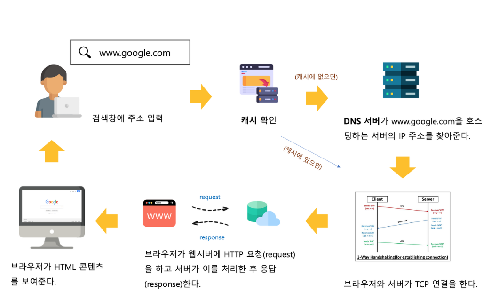

## 1장

## 보안

`보안` : 안전 안심을 의미 , 사용자가 애플리케이션을 안심하고 사용할 수 있도록 개발자는 애플리케이션 보안을 보장할 수 있다.

`취약성` : '상처 입기 쉬운 상태'

`기능 요건 ` : 소프트웨어 요구사항

```
예약 앱 : 예약 기능, 회원 기능
```

`비기능 기능 ` : 주목적은 아니난 퀄리티를 위해서 요구되는 기능

```
3초안에 응답이 와야한다.
```

`미들웨어` : 양 쪽의 소프트웨어 연결을 주고 받을 수 읶도록 하는 매개체를 의미한다.

### 3장

기본 적으로 웹 어플리케이션은 서버가 보낸 html, css, 이미지 등의 리소스 데이터를 사용해 구성된다.

브라우저는 HTTP 라고 하는 통신 프로토콜에 따라 서버와 통신해 리소스를 가져오거나 데이터를 생성하고 업데이트 하는 작업을 거친다.

흐름도

1. 사용자는 URL을 입력한다 .
2. 입력한 URL을 바탕으로 브라우저에서 DNS 서버에 주소에 관한 요청을 보낸다.
3. DNS서버는 받은 주소 요청을 해독해 브라우저에 보낸다.
4. 받은 해독값을 바탕으로 브라우저는 서버에 리소스를 요청 한다.
5. 서버는 리소스를 전송하고
6. 페이지에 화면을 표시한다.



`URL`:

```
프로토콜/호스트명:포트/경로
http://naver.com:13/path/game

프로토콜 : 통신 프로토콜을 표시한다.

호스트명 : 서버 위치를 표시한다.

포트 번호 : 서버에서 서비스를 식별하는 번호이다. 웹 어플리케이션마다 다른 포트를 할해서 다양한 서비스를 제공할 수 있다. 기본적 http는 80번이다.
```

`FQDN` : 호스트명(moodi) + 도메인 이름(.life)

개인적 궁금증 왜 도메인 이름이 필요한가.

- 초장기 웹사이트는 기술적 한계 떄문에 평면적 네이밍보단 계층화를 통한 방식을 도입하기로 함
- 도메인 이름은 위 사이트가 어떤 용도인지 알려줌

```
ex) apple 만 쳐선 이게 애플 뮤직인지 애플 공사이튼지 알 수 없다.
apple.music / apple.com

```

`TCP/IP` : 정해진 순서를 따르지 않으면 데이터를 제대로 전달 할 수 없다. 그렇기에 정해진 규약에 따라 데이터를 주고 받아야한다.

- 이를 통신 프로토콜이라 칭한다.

응용 - 전송 - 인터넷 - 네트워크 접속

### 응용 계층(Application Layer):

사용자와 직접 상호작용하는 계층
프로토콜: HTTP, HTTPS, FTP, SMTP, DNS, SSH 등
역할: 어떤 서비스를 사용할지 결정하고 사용자 인터페이스 제공

### 전송 계층(Transport Layer):

애플리케이션 간의 통신 제공
프로토콜: TCP(신뢰성 우선), UDP(속도 우선)
역할: 데이터 분할, 오류 검출, 흐름 제어, 데이터 전달 보장(TCP의 경우)

### 인터넷 계층(Internet Layer):

다른 네트워크 간의 통신 제공
프로토콜: IP(IPv4, IPv6), ICMP, ARP
역할: 패킷의 라우팅(경로 결정), 주소 지정, 패킷 전달

### 네트워크 인터페이스 계층(Network Interface Layer):

물리적 네트워크와의 인터페이스
프로토콜: 이더넷, Wi-Fi, PPP 등
역할: 데이터를 전기 신호로 변환, MAC 주소를 이용한 장치 식별

### HTTP 메시지

- 요청과 응답 2가지가 존재한다.

### 요청

- 브라우저에서 서버로 보내는 것
- 요청 라인 / 헤더 바디

#### HTTP 요청 라인(Request Line) 종류 정리

HTTP 요청의 첫 번째 줄인 요청 라인은 메서드, URI, HTTP 버전으로 구성되어 있다.

##### 1. HTTP 메서드(Method)

| 메서드      | 용도                  | 특징                                               |
| ----------- | --------------------- | -------------------------------------------------- |
| **GET**     | 리소스 조회           | 서버에서 데이터를 가져오는 용도, URL에 데이터 노출 |
| **POST**    | 리소스 생성           | 서버에 데이터 제출, 요청 본문에 데이터 포함        |
| **PUT**     | 리소스 전체 수정/교체 | 지정한 URI에 리소스를 완전히 대체                  |
| **PATCH**   | 리소스 부분 수정      | 리소스의 일부만 변경                               |
| **DELETE**  | 리소스 삭제           | 지정한 리소스 제거                                 |
| **HEAD**    | 헤더만 조회           | GET과 동일하지만 응답 본문은 받지 않음             |
| **OPTIONS** | 지원 메서드 확인      | 해당 리소스에 대해 서버가 지원하는 메서드 확인     |
| **TRACE**   | 요청 메시지 루프백    | 클라이언트와 서버 사이의 모든 HTTP 헤더 반환       |
| **CONNECT** | 프록시 연결           | 프록시를 통해 SSL 통신을 할 때 사용                |

## 2. 요청 URI(Request URI)

- 요청하는 리소스의 위치/경로를 나타냄
- 예시:
  - `/index.html`
  - `/api/users`
  - `/images/logo.png`
  - `/search?q=keyword`

### 응답

- 서버에서 브라우저로 보내는 것
- 응답 라인 / 헤더 / 바디

#### HTTP 상태 코드(Status Code) 정리

HTTP 응답의 상태를 나타내는 3자리 숫자로, 클라이언트의 요청 처리 결과를 알려줍니다.

##### 1xx (정보 응답)

| 코드    | 설명                | 의미                                   |
| ------- | ------------------- | -------------------------------------- |
| **100** | Continue            | 클라이언트가 계속 요청을 이어나가도 됨 |
| **101** | Switching Protocols | 프로토콜 전환 요청 수락                |
| **102** | Processing          | 요청을 수신했으나 아직 처리 중         |

##### 2xx (성공 응답)

| 코드    | 설명            | 의미                                      |
| ------- | --------------- | ----------------------------------------- |
| **200** | OK              | 요청 성공                                 |
| **201** | Created         | 리소스 생성 성공                          |
| **202** | Accepted        | 요청은 수락했지만 아직 처리 완료되지 않음 |
| **204** | No Content      | 요청은 성공했지만 응답 본문 없음          |
| **206** | Partial Content | 부분적 콘텐츠 요청 성공 (범위 요청)       |

##### 3xx (리다이렉션)

| 코드    | 설명               | 의미                                 |
| ------- | ------------------ | ------------------------------------ |
| **300** | Multiple Choices   | 여러 리소스 선택 가능                |
| **301** | Moved Permanently  | 영구적으로 리소스 위치 변경됨        |
| **302** | Found              | 일시적으로 리소스 위치 변경됨        |
| **303** | See Other          | 다른 위치로 요청해야 함 (GET 사용)   |
| **304** | Not Modified       | 캐시된 리소스가 여전히 유효함        |
| **307** | Temporary Redirect | 일시적 리다이렉션 (메서드 변경 없음) |
| **308** | Permanent Redirect | 영구적 리다이렉션 (메서드 변경 없음) |

##### 4xx (클라이언트 오류)

| 코드    | 설명               | 의미                                          |
| ------- | ------------------ | --------------------------------------------- |
| **400** | Bad Request        | 잘못된 요청 구문, 유효하지 않은 요청          |
| **401** | Unauthorized       | 인증 필요                                     |
| **403** | Forbidden          | 리소스에 접근 권한 없음                       |
| **404** | Not Found          | 요청한 리소스를 찾을 수 없음                  |
| **405** | Method Not Allowed | 리소스에서 허용되지 않은 메서드 사용          |
| **409** | Conflict           | 요청이 현재 서버 상태와 충돌                  |
| **413** | Payload Too Large  | 요청 본문이 너무 큼                           |
| **429** | Too Many Requests  | 일정 시간 내에 너무 많은 요청 (rate limiting) |

##### 5xx (서버 오류)

| 코드    | 설명                  | 의미                                                         |
| ------- | --------------------- | ------------------------------------------------------------ |
| **500** | Internal Server Error | 서버 내부 오류                                               |
| **501** | Not Implemented       | 요청한 기능이 구현되지 않음                                  |
| **502** | Bad Gateway           | 게이트웨이나 프록시가 업스트림 서버로부터 잘못된 응답을 받음 |
| **503** | Service Unavailable   | 일시적으로 서비스 이용 불가 (과부하 또는 유지보수)           |
| **504** | Gateway Timeout       | 게이트웨이나 프록시의 응답 시간 초과                         |

## 자주 사용되는 상태 코드

- **200**: 요청 성공
- **201**: 리소스 생성 성공 (POST 요청 후)
- **400**: 잘못된 요청
- **401**: 인증 필요
- **403**: 권한 없음
- **404**: 리소스 없음
- **500**: 서버 오류

### HTTP 헤더란

바디의 부수적 정보와 데이터 송수신에 필요한 정보이다.

#### 요청 헤더

- HOST : 서버의 포스트명과 포트 번호를 지정하며 디폴트 포트 번호를 생략한다.

- USER AGENT : 요청을 보내는 쪽의 정보를 전달한다.

- Refere : 접속을 요청하는 웹 애플리케이션의 url을 서버에 전달한다.

#### 응답 헤더

- SERVER : Response에 사용된 서버의 소프트웨어 정보를 브라우저에 전달한다.

- LOCATION : 리다이렉트 URL을 지정한다.

#### 둘 다 사용되는 엔티티 헤더

- `content - length` : 리소스의 크기를 바이트 단위로 표시한다.

- `content-type` : 리소스 미디어 종류를 표시한다.

### 안전한 통신을 위한 HTTPS

#### HTTP의 약점

- HTTP는 통신 데이터를 암호화 하는 시스템이 존재 하지 않는다.

- HTTP는 통신 대상 서버가 실제 서버인지 진위 여부를 확인할 수 없다.

- 통신 과정에서 데이터 수정 여부가 확인이 안되는 점

### 해결법

- 위와 같은 문제를 해결하는 것이 `HTTPS`(HTTP + TLS ) 이다.

### SECURE CONTENT

- 웹의 발전과 함께 더욱더 강력한(개인 정보의 노출이 많은) API들이 추가되기 시작했다 이들은 모두 `HTTPS`에서만 동작을 하도록 적용되어 있다.

```
EX) SERVICE WORKER, PAYMENT API
```

### MIXED CONETENT

- `HTTP`와 `HTTPS`의 혼합 상태를 의미한다.
- `HSTS`를 이용하면 사용자가 `HTTPS`요청만 사용하도록 강제할 수 있다.

- 이를 위해서 서버 측에서 응답 헤더에
  `Strict- TransPort - Security` 헤더를 추가할 수 있다. 또한 `includeSubdomain` 속성을 추가하면 서브 도메인에서도 `Https` 를 자동으로 사용한다.
